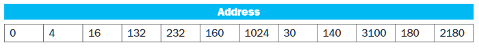
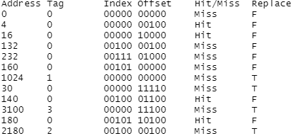

# CS 402 Homework 4

Muhammad Umar

#### 5.1 In this exercise we look at memory locality properties of matrix computation. Th e following code is written in C, where elements within the same row are stored contiguously. Assume each word is a 32-bit integer.

> for (I=0; I\<8; I++)

> > for (J=0; J\<8000; J++)

> > > A\[I\]\[J\]=B\[I\]\[0\]+A\[J\]\[I\];

##### 5.1.1 How many 32-bit integers can be stored in a 16-byte cache block?

As 1 byte = 8 bits

Then, 32/8 = 4 bytes

Hence, 16/4 = 4 integers

So, 4 integers of 32-bit size can be stored in a 16-byte cache block.

##### 5.1.2 References to which variables exhibit temporal locality?

References to variables “i”,“j” and “B\[I\]\[0\]” exhibit temporal
locality.

##### 5.1.3 References to which variables exhibit spatial locality?

References to variable “A\[I\]\[J\]” exhibit spatial locality.

##### Locality is affected by both the reference order and data layout. The same computation can also be written below in Matlab, which differs from C by storing matrix elements within the same column contiguously in memory.

> for I=1:8

> > for J=1:8000

> > > A(I,J)=B(I,0)+A(J,I);

> > end

> end

##### 5.1.4 How many 16-byte cache blocks are needed to store all 32-bit matrix elements being referenced?

There are 8 \* 8000 = 64,000 accesses for A\[I\]\[J\]. Similarly,
A\[J\]\[I\] is accessed for 64,000 times as well. However, we have an
overlap of the first 8 values, 8 times, i.e., 64 that will only be
cached once. Hence, we need to store:

> (2 \* 64,000) - 64 = 1.2794410^{5} elements

And to store them, we need:

> 1.2794410^{5}/4 = 3.198610^{4} cache blocks

##### 5.1.5 References to which variables exhibit temporal locality?

References to variables “i”,“j” and “B\[I\]\[0\]” exhibit temporal
locality.

##### 5.1.6 References to which variables exhibit spatial locality?

References to variable “A\[J\]\[I\]” exhibit spatial locality as columns
are stored contiguously.

##### 5.2 Caches are important to providing a high-performance memory hierarchy to processors. Below is a list of 32-bit memory address references, given as word addresses.

> 3, 180, 43, 2, 191, 88, 190, 14, 181, 44, 186, 253

##### 5.2.1 For each of these references, identify the binary address, the tag, and the index given a direct-mapped cache with 16 one-word blocks.. Also list if each reference is a hit or a miss, assuming the cache is initially empty.

##### 5.2.2 For each of these references, identify the binary address, the tag, and the index given a direct-mapped cache with two-word blocks and a total size of 8 blocks. Also list if each reference is a hit or a miss, assuming the cache is initially empty.

##### 5.3 For a direct-mapped cache design with a 32-bit address, the following bits of the address are used to access the cache.

##### 5.3.1 What is the cache block size (in words)?

Cache block size = 2^(offset bits) = 2^5 bytes = 32 bytes

As we know, 4 bytes = 1 word. Hence,

Cache block size = 32/4 = 8 words

##### 5.3.2 How many entries does the cache have?

Cache entries/blocks = 2^(index bits) = 2^5 = 32 entries

##### 5.3.3 What is the ratio between total bits required for such a cache implementation over the data storage bits?

Total bits = entries \* ( valid bit(1) + tag bits + cache size \* data
bits)

Total bits = 32 \* ( 1 + 22 + (32 \* 8)) = 8928

Data storage bits = entries \* cache size \* data bits

Data storage bits = 32 \* 32 \* 8 = 8192

Total bits/Data storage bits ratio = 8928/8192 = 1.0898438

##### Starting from power on, the following byte-addressed cache references are recorded.

##### 5.3.4 How many blocks are replaced?

Hence, **four** tables are being replaced.

##### 5.3.5 What is the hit ratio?

Using the table above, we can see we have 4 hits out of 12. Hence,

Hit Ratio = 4/12 = 33.34%

##### 5.3.6 List the final state of the cache, with each valid entry represented as a record of \<index, tag, data\>.

\<00100, 0010, mem\[2176\]-mem\[2207\]\>

\<00101, 0000, mem\[160\]-mem\[191\]\>

\<00000, 0011, mem\[3072\]-mem\[3103\]\>

\<00111, 0000, mem\[224\]-mem\[255\]\>

##### 5.5 Media applications that play audio or video files are part of a class of workloads called “streaming” workloads; i.e., they bring in large amounts of data but do not reuse much of it. Consider a video streaming workload that accesses a 512 KiB working set sequentially with the following address stream:

> 0, 2, 4, 6, 8, 10, 12, 14, 16, …

##### 5.5.1 Assume a 64-KiB direct-mapped cache with a 32-byte block. What is the miss rate for the address stream above? How is this miss rate sensitive to the size of the cache or the working set? How would you categorize the misses this workload is experiencing, based on the 3C model?

32 byte block size = log2(32) = 5 offset bits

This means that 0 address will miss and 0 to 31 (1 1111) will brought in
to cache. Hence, subsequent accesses to 2, 4, 6, .., 30 will hit.

Similarly, 32 will miss and then 34, 36, 38, …, 62 will hit. Hence,
there is a miss for every 16 accesses.

Therefore, the miss rate is

1/16 = 6.25%

##### 5.5.2 Re-compute the miss rate when the cache size is 16 bytes, 64 bytes, and 128 bytes. What kind of locality is this workload exploiting?

16 bytes = 4 offset bits (1111)

Memory access is with a displacement of 2. Hence, there will be a miss
for:

16/2 = 8 accesses

Miss Rate for 16 = 1/8

Miss Rate for 64 = 1/32

Miss Rate for 128 = 1/64

This kind of workload exploits spatial locality (neighboring address
accesses).

##### 5.6 In this exercise, we will look at the different ways capacity affects overall performance. In general, cache access time is proportional to capacity. Assume that main memory accesses take 70 ns and that memory accesses are 36% of all instructions. The following table shows data for L1 caches attached to each of two processors, P1 and P2.

##### 5.6.1 Assuming that the L1 hit time determines the cycle times for P1 and P2, what are their respective clock rates?

Cycle Time = 1/Hit Time

P1 Cycle Time = 1/0.66 = 1.5151515 GHz

P2 Cycle Time = 1/0.90 = 1.1111111 GHz

##### 5.6.2 What is the Average Memory Access Time for P1 and P2?

AMAT = Hit Time + (Miss Rate \* Memory access time)

P1 AMAT = 0.66 + ((8/100) \* 70)

P1 AMAT = 6.26 seconds

P2 AMAT = 0.90 + ((6/100) \* 70)

P2 AMAT = 5.1 seconds

##### 5.6.3 Assuming a base CPI of 1.0 without any memory stalls, what is the total CPI for P1 and P2? Which processor is faster?

Total CPI = base CPI + (Instructions \* Memory access time \* Miss
Rate)/Hit Rate

Total CPI for P1 = 1 + (0.36 \* 70 \* 8/100)/0.66 = 4.0545455

Total CPI for P2 = 1 + (0.36 \* 70 \* 6/100)/0.90 = 2.68

Hence, P2 is faster
