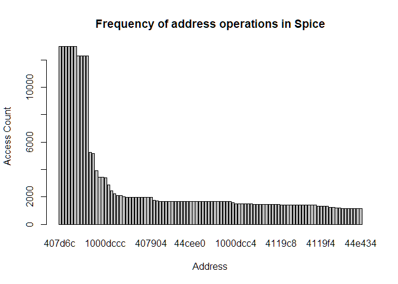
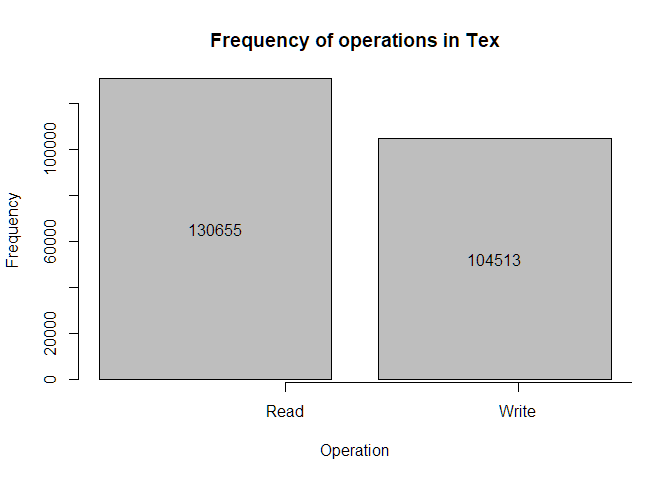

# CS 402 Homework 1

Muhammad Umar

#### Question 1

##### (a) Using trace files, i.e. files that contain addresses issued by some CPU to execute some application(s), draw the **histogram** of address distribution for each of them (2x20 points). On the Ox axis of the plot you will have the address number (don’t start with zero, rather with the smallest address you find in the file and go up to the maximum address in the file). On the Oy axis you will have the number of occurrences for each particular address.

###### Spice.din

```r
data1 <- read.csv("spice.din", sep=" ",header=F, stringsAsFactors = F)
addressFreq1 <- table(data1[,2])
barplot(addressFreq1, main="Frequency of address operations in Spice", xlab = "Address", ylab = "Access Count")
```

<!-- -->

###### Tex.din

```r
data2 <- read.csv("tex.din", sep=" ",header=F, stringsAsFactors = F)
addressFreq2 <- table(data1[,2])
barplot(addressFreq2, main="Frequency of address operations in Tex", xlab = "Address", ylab = "Access Count")
```

<!-- -->

##### Comment based on the histograms (5).

```r
# Sort as frequency table as descending and fetch the first name
spiceMaxName<-names(sort(-table(data1[,2])))[1]
texMaxName<-names(sort(-table(data2[,2])))[1]
```

The most highest operation count for an address in spice.din was
0x407d6c while for tex.din, it was 0x432838, although the bar plots look
very similar for both.

##### (b) What is the frequency of writes (5)? What is the frequency of reads (5)?

###### Spice.din

```r
x1<-data1$V1
maxX1<-max(table(x1))
{bp1 <- barplot(
  table(data1$V1), xaxt="n", main="Frequency of operations in Spice",ylim=(c(0,maxX1)), xlab="Operation", ylab="Frequency"
  )
  axis(1, at=1:3, labels=c("Read","Write","Fetch"))
  options(scipen = 6)
  text(x=bp1, y= table(x1)/2, labels=as.character(table(x1)))
}
```

<!-- -->
The frequency of writes is 66538 while the frequency of reads is 150699
in the spice file.

###### Tex.din

```r
x2<-data2$V1
maxX2<-max(table(x2))
{bp2 <- barplot(
  table(data2$V1), main="Frequency of operations in Tex",
  xlab="Operation", ylab="Frequency", xaxt="n"
  )
  options(scipen = 5)
  axis(1, at=1:3, labels=c("Read","Write","Fetch"))
  text(x=bp2, y= table(x2)/2, labels=as.character(table(x2)))
}
```

<!-- -->
The frequency of writes is 66538 while the frequency of reads is 150699
in the tex file.

##### Please comment on these results (5).

Both spice.din and tex.din files show that instruction fetch was the
most common operation with spice having 782764 operations and tex having
597309 operations. They both have more read operations than write as
well. This makes sense as they address has to be fetched regardless of
whether read or write will be performed and it is common to read the
value, then perform some computation or mutate it accordingly then write
it again on either the same or other address.

#### Question 2

##### (a) Write a program, using your favorite programming language, that multiplies two rectangular matrices – please no square matrices – whose elements are randomly generated. You will have two versions of the program, one in which matrix elements are integers and another one where they are real numbers (double) (2x15 points). Measure the time it takes each program to complete (2x5) and then compare the performance of the two systems (5).

<table class="kable_wrapper">

<caption>

Machine 1 vs Machine 2 time taken in seconds

</caption>

<tbody>

<tr>

<td>

| Runs | Integer |   Float |
| ---: | ------: | ------: |
|    1 | 4.96672 | 5.70465 |
|    2 | 5.29337 | 5.20660 |
|    3 | 5.33969 | 5.51428 |
|    4 | 5.05501 | 5.34071 |
|    5 | 5.34676 | 5.58114 |
|    6 | 5.02560 | 5.48730 |
|    7 | 5.39096 | 5.60357 |
|    8 | 5.41396 | 5.64611 |
|    9 | 5.37972 | 5.73424 |
|   10 | 5.26595 | 5.46428 |

</td>

<td>

| Runs | Integer |   Float |
| ---: | ------: | ------: |
|    1 | 6.73228 | 7.62045 |
|    2 | 6.66859 | 7.11992 |
|    3 | 7.09571 | 6.77833 |
|    4 | 7.21846 | 7.00182 |
|    5 | 7.44075 | 6.97693 |
|    6 | 7.10797 | 7.28310 |
|    7 | 7.33325 | 6.87675 |
|    8 | 6.88468 | 6.80096 |
|    9 | 6.89846 | 7.76262 |
|   10 | 6.84239 | 6.87293 |

</td>

</tr>

</tbody>

</table>

###### Performance Comparison

| Matrix Type | Machine 1 Average | Machine 2 Average |
| :---------- | ----------------: | ----------------: |
| Integer     |          5.247774 |          7.022254 |
| Float       |          5.528288 |          7.109381 |

On average, Integer operations are 28.3% slower on the 2nd machine while
float operations are 37.8% slower.

##### Is the performance ratio the same as the clock rate ratio of the two systems (5)? Explain.

No, the clock speed of the first machine is 150% greater (3.3 GHz versus
2.2 Ghz of the second) while the difference in performance is less than
40% on average.

This is because clock speeds are not the determining factor of computer
performance but cycles per instruction is. Other factors such as
available cache, type of storage (NVME SSD vs SATA SSD), type of RAM
depending on architecture (DDR4 vs LPDDR3) all affect cycles per
instruction.

##### Based on the retail price of the two systems, which one is more cost effective (5)?

The first machine is a GT73VR with a Skylake i7 (6th generation) running
at 3.3GHz clock speed with a M2 NVMe SSD and costs approximately \$1500
today. The second machine is a 15 inch Macbook Pro 2015 equipped with a
Broadwell i7 (5th generation) running at 2.2Ghz clock speed with a M2
SSD and costs approximately \$1100 today.

The first machine is 36% more expensive while the difference of
performance is greater than 38%.

Hence, the first machine (MSI GT73VR) is more cost effective.

##### (b) Change your multiplication algorithm and repeat the steps above; for instance, if you used the the naive multiplication algorith with the column in the inner loop, then just use the same algorithm with the row in the inner loop (same scoring as part a).

<table class="kable_wrapper">

<caption>

Machine 1 vs Machine 2 time taken in seconds (rows in inner loop)

</caption>

<tbody>

<tr>

<td>

| Runs | Integer |   Float |
| ---: | ------: | ------: |
|    1 | 4.80913 | 5.40437 |
|    2 | 5.23265 | 5.16091 |
|    3 | 4.88205 | 4.99780 |
|    4 | 5.08705 | 5.22991 |
|    5 | 5.04049 | 5.07952 |
|    6 | 5.10803 | 5.24946 |
|    7 | 5.11938 | 5.42984 |
|    8 | 5.13538 | 5.33022 |
|    9 | 5.06068 | 5.28904 |
|   10 | 5.28394 | 5.30617 |

</td>

<td>

| Runs | Integer |   Float |
| ---: | ------: | ------: |
|    1 | 6.75647 | 7.42215 |
|    2 | 7.34534 | 7.28856 |
|    3 | 6.89118 | 7.33798 |
|    4 | 6.97223 | 7.11317 |
|    5 | 7.05036 | 7.36661 |
|    6 | 6.91155 | 7.57345 |
|    7 | 6.76589 | 7.48034 |
|    8 | 6.73468 | 7.48641 |
|    9 | 7.58147 | 7.50841 |
|   10 | 6.96372 | 7.38413 |

</td>

</tr>

</tbody>

</table>

###### Performance Comparison

| Matrix Type | Machine 1 Average | Machine 2 Average |
| :---------- | ----------------: | ----------------: |
| Integer     |          5.075878 |          6.997289 |
| Float       |          5.247724 |          7.396121 |

On average, Integer operations are 37.85% slower on the 2nd machine
while float operations are 40.94% slower.

##### Machine Description

| Attribute               | Machine 1  | Machine 2                     |
| :---------------------- | :--------- | :---------------------------- |
| Manufacturer            | MSI        | Apple                         |
| CPU Type                | i7-6820HK  | i7 Broadwell (5th generation) |
| Clock Speed             | 3.3GHz     | 2.2 GHz                       |
| RAM                     | 32GB       | 16 GB                         |
| OS                      | Windows 10 | macOS Catalina                |
| Compiler                | G++ MinGW  | LLVM-g++                      |
| SSD Random Read Speeds  | 39.24 MB/s | 19.27 MB/s                    |
| SSD Random Write Speeds | 88.6 MB/s  | 30.98 MB/s                    |
| Price                   | \$1,500    | \$1100                        |

The SSD read/write speeds were taken using Crystal Disk Mark’s random
4kb read/write single-thread test
